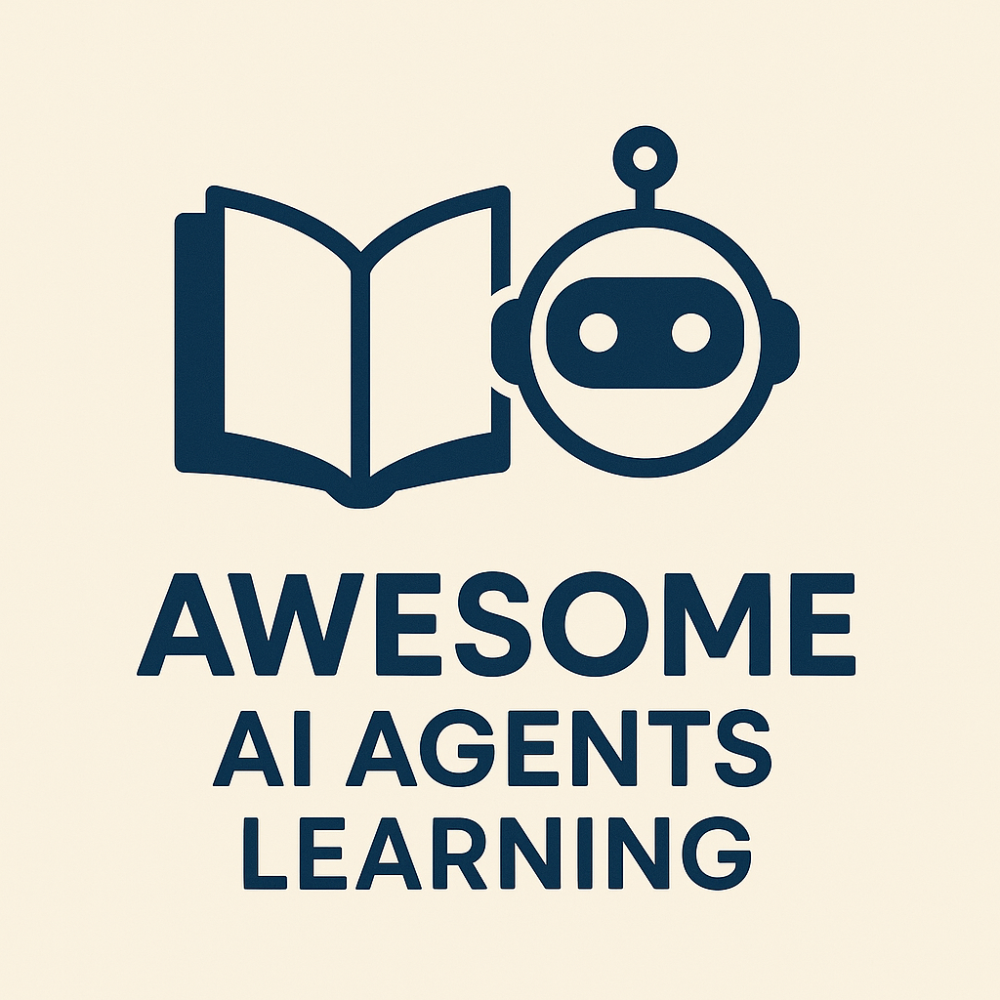

# Awesome AI Agents Learning

Curated resources for stduying AI agents.

## Courses
* https://github.com/microsoft/ai-agents-for-beginners
* https://huggingface.co/learn/agents-course/
* https://www.coursera.org/learn/agentic-ai, https://www.coursera.org/learn/learn-ai-agents 
* https://www.deeplearning.ai/short-courses/multi-ai-agent-systems-with-crewai/

## Frameworks
* https://github.com/huggingface/smolagents

## Quick Guides and Turorials
* https://medium.com/design-bootcamp/comprehensive-guide-to-ai-agents-in-2025-683651f8d2e6
* https://medium.com/@harshnpathak/mastering-ai-agent-planning-a-comprehensive-guide-912c96424cca

## Related Lists
* https://www.reddit.com/r/singularity/comments/1hvrjfx/what_courses_or_resources_can_help_me_create_ai/
* https://medium.com/@maximilian.vogel/mastering-ai-agents-the-10-best-free-courses-tutorials-learning-tools-46bc380a19d1
* https://github.com/e2b-dev/awesome-ai-agents
* https://github.com/Jenqyang/Awesome-AI-Agents
