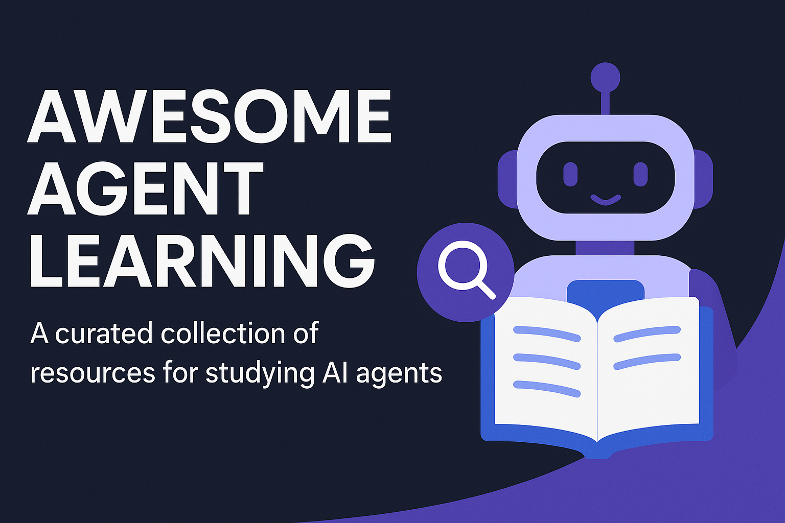

# Awesome Agent Learning
   

  

A curated collection of resources for studying AI agents updated regularly to help you understand, build, and evaluate autonomous AI/LLM agents.

<!-- omit from toc -->
## Contents

- [Foundational Courses](#foundational-courses)
- [Conceptual Guides](#conceptual-guides)
- [Framework Tutorials](#framework-tutorials)
- [Evaluation Benchmarks](#evaluation-benchmarks)
- [Related Resources](#related-resources)

## Foundational Courses

- **[Advanced Large Language Model Agents](https://llmagents-learning.org/)** — a graduate-level course exploring the design and deployment of LLM-powered agents. Covers LLM foundations and infrastructure, reasoning, tool use, multi-agent collaboration, and various applications. Features guest lectures from leading researchers.
- **[Agentic AI and AI Agents: A Primer for Leaders](https://www.coursera.org/learn/agentic-ai)** — a concise course designed for non-technical executives and product managers who want to learn fundamentals of AI agents. Provides relevant theory and teaches no-code approaches of implementing AI agents using custom GPTs.
- **[Hugging Face's AI Agents Course](https://huggingface.co/learn/agents-course/)** — a hands-on program designed to guide from foundational agents concepts to deploying autonomous AI agents. Covers agent fundamentals as well as practical implementation using different popular frameworks (smolagents, LlamaIndex, LangGraph). Includes assignments and a final project with building, deploying and evaluating your own agent.
- **[Learn AI Agents Handbook](https://www.learn-agents.diy/)** — an interactive handbook/roadmap for building autonomous AI agents.
- **[Microsoft's AI Agents for Beginners](https://github.com/microsoft/ai-agents-for-beginners)** — a beginner-friendly but comprehensive open-source course comprising 11 lessons on building AI agents. Covers tool integration, RAG, agentic design patterns, multi-agent systems, deploying in production. Lessons include written materials, code samples and videos. Focused on Microsoft frameworks (Azure AI Agent Service, 
Semantic Kernel, AutoGen).
- **[Multi AI Agent Systems with crewAI](https://www.deeplearning.ai/short-courses/multi-ai-agent-systems-with-crewai/)** — a beginner-friendly course teaching how to build and deploy AI agents using CrewAI framework. Covers basic concepts including tools management, memory organization, errors handling, agent cooperation. Introduces a lot of AI agent examples for common business processes.

## Conceptual Guides

- **[A Practical Guide to Building Agents (OpenAI)](https://cdn.openai.com/business-guides-and-resources/a-practical-guide-to-building-agents.pdf)** — a step-by-step playbook offering best practices for designing autonomous AI agents. It covers identifying suitable problems, agent architecture, and measuring success.
- **[A Survey on Large Language Model based Autonomous Agents](https://arxiv.org/abs/2308.11432)** — an academic survey that systematically examines the construction, applications, and evaluation of LLM-based autonomous agents. The work also discusses evaluation strategies and outlines future research directions.
- **[Building effective agents (Anthropic)](https://www.anthropic.com/engineering/building-effective-agents)** — an in-depth guide by Anthropic offering practical strategies for designing LLM-based agents. Emphasizes starting with simple, composable patterns—like prompt chaining and routing—before progressing to more autonomous, tool-using agents.
- **[LLM Powered Autonomous Agents (Lilian Weng)](https://lilianweng.github.io/posts/2023-06-23-agent/)** — a comprehensive blog post exploring the architecture of autonomous LLM agents. The article covers theory and implementation of LLM agents components and their internals.
- **[What Are AI Agents?](https://medium.com/codex/what-are-ai-agents-your-step-by-step-guide-to-build-your-own-df54193e2de3)** — an article that introduces AI agents and provides a step-by-step guide to building one. The article offers a practical walkthrough of building such agents with the focus on business architecture, the implementation is left to the readers.

## Framework Tutorials

- **[AutoGPT Guide](https://docs.agpt.co/platform/getting-started/)** — a step-by-step tutorial for setting up the full AutoGPT platform locally. Covering both backend and frontend configurations, enabling developers to build and manage AI agents.
- **[CrewAI Quickstart Guide](https://docs.crewai.com/quickstart)** — a hands-on tutorial walking through building a multi-agent system using CrewAI framework. It demonstrates how to define different agent roles, assign tasks and orchestrate their collaboration.
- **[Haystack Tutorials](https://haystack.deepset.ai/tutorials)** — a collection of Haystack tutorials covering building, evaluating and deploying agentic pipelines.
- **[Hugging Face smolagents Tutorials](https://huggingface.co/docs/smolagents/tutorials/building_good_agents)** — examples that outline best practices for building AI agents using smolagents framework.
- **[LangChain: Build an Agent](https://python.langchain.com/docs/tutorials/agents/)** — a hands-on guide by Microsoft that demonstrates how to build an AI assistant capable of tool use with minimal setup.
- **[LlamaIndex Learning](https://docs.llamaindex.ai/en/stable/understanding/)** — a guide walking through building agentic applications using LlamaIndex. It covers LLM basics, constructing agents, designing workflows, and implementing RAG pipelines.
- **[Microsoft AutoGen AgentChat Quickstart & Tutorial](https://microsoft.github.io/autogen/stable/user-guide/agentchat-user-guide/quickstart.html)** — a quick tutorial guiding through building an AI assistant using Microsoft's AutoGen AgentChat framework.
- **[OpenAI Agents SDK Examples](https://openai.github.io/openai-agents-python/examples/)** — a comprehensive collection of practical examples demonstrating how to build AI agents. Organized into categories like agent patterns, tool integration, model providers, and real-world applications, providing examples for common design patterns, tool usage, and multi-turn orchestration.
- **[OpenAI Assistants API](https://platform.openai.com/docs/assistants/quickstart)** — a step-by-step tutorial on building AI assistants using OpenAI's Assistants API. It covers creating assistants with specific instructions, integrating tools like code execution and file search, and managing conversations.

## Evaluation Benchmarks

- **[AgentBench](https://github.com/THUDM/AgentBench)** — a systematic multi-domain benchmark for measuring LLMs in autonomous agent roles, spanning 8 tasks (including OS management, SQL ops, web browsing/shopping, games, puzzles). Introduced a leaderboard for reproducible comparison.
- **[BrowseComp](https://openai.com/index/browsecomp/)** — a benchmark featuring 1200+ human-crafted questions designed to assess agents ability to find hard-to-locate information across the web.
- **[GAIA](https://huggingface.co/spaces/gaia-benchmark/leaderboard)** — a 450-question benchmark that tests an agent's reasoning, web search, tool-use and multimodal understanding through short-answer tasks split into 3 difficulty levels.
- **[OSWorld](https://github.com/xlang-ai/OSWorld)** — a benchmark for evaluating multimodal agents on 350+ real web- and desktop-tasks, including UI/GUI manipulations, and graded only by execution traces.
- **[SWE-bench](https://github.com/SWE-bench/SWE-bench)** — a large-scale benchmark of 2k+ real-world github issues from Python repositories, where LLM agents must generate patches and pass tests, all inside a docker environment fully reproducible evaluation. Includes multiple extra versions: Lite with easy tasks, Verified with hand-validated issues, and Multimodal.
- **[ToolBench](https://github.com/sambanova/toolbench)** — an 8-task benchmark that asks agents to call real APIs from different web services, including weather, spreadsheets, shopping, reservations, and virtual environments.
- **[WebArena](https://webarena.dev/)** — a realistic, self-hosted benchmark environment comprising 4 web applications: e‑commerce, forums, CMS, code — 800+ long-horizon tasks.

## Related Resources

- **[e2b-dev/awesome-ai-agents](https://github.com/e2b-dev/awesome-ai-agents)** — a curated GitHub repository featuring a comprehensive list of AI autonomous agents and frameworks.
- **[Mastering AI Agents: The 10 Best Free Courses, Tutorials & Learning Tools](https://medium.com/@maximilian.vogel/mastering-ai-agents-the-10-best-free-courses-tutorials-learning-tools-46bc380a19d1)** — a curated list of resources on AI Agents learning organized by skill level.

<!-- omit from toc -->
## Contributing

Feel free to contribute! Please read the [contribution guidelines](contributing.md) first.
